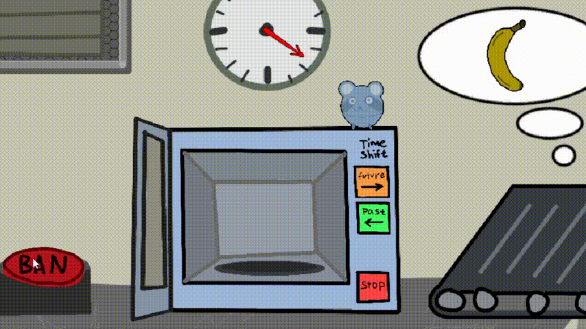

# Banana Time Machine

* **Поиграть на Itch.io:** [ciretrus.itch.io/banana-time-machine](https://ciretrus.itch.io/banana-time-machine)
* **Mini Jame Gam #54:** [Страница проекта на джеме](https://itch.io/jam/mini-jame-gam-54/rate/4538134)

---



---

## Ключевые решения системного и технического GD

### 1. Непрерывная шкала спелости и механика передержки (Риск / Награда)
В игре про «машину времени» важно было дать игроку не просто бинарное состояние (сырой / готовый), а непрерывный аналоговый процесс с азартом и ценой ошибки.

* **Как решено:** В `BananaSettings` параметр спелости (`freshness`) задан диапазоном чисел с плавной интерполяцией через два градиента цвета (зеленый → желтый → переспелый коричневый). При зажатии кнопки перемотки времени в микроволновке (`TimeButtons`) банан непрерывно изменяет возраст и вращается.
* **Влияние на баланс:** Реализованы критические пороги взрыва (`freshness < -0.5` и `freshness > 2.5`). Игрок стремится подогнать фрукт как можно ближе к заказу, балансируя на грани уничтожения банана со спецэффектом взрыва.

---

### 2. Экономика заказов и штраф за погрешность
Для поддержки интереса требовалась прозрачная и быстрая математическая модель оценки качества работы игрока.

* **Подход к формуле:** В `BuyBanana` и `SellBanana` награда рассчитывается системно:
  ```text
  Итоговая награда = Базовая цена - (|Спелость_факт - Спелость_заказ| × 100)
  ```
  * За совпадение типа банана дается базовая цена `100`, за несовпадение — `50`.
  * Штраф прямо пропорционален погрешности спелости.
* **Результат:** Игрок четко считывает, стоило ли тратить лишнюю секунду в микроволновке. При грубых ошибках счет может уходить в минус, что мотивирует играть точнее, а не спамить фруктами.

---

### 3. Физический Drag & Drop и сочность фидбека (Game Feel)
* **Физика переноски:** В `BananaMove` перетаскивание реализовано через векторное ускорение (`Rigidbody2D.velocity = direction * followSpeed`). Банан имеет массу, приятно пружинит за курсором и реагирует на коллайдеры окружения.
* **Микро-анимации:** Механика спавна через трубу, закрытие дверцы микроволновки, облачка заказов и плавный пересчет очков анимированы через **DOTween** с настроенными Ease-кривыми (`OutBack`, `InBack`).
* **Модульная архитектура:** Логика построена на C# `event Action` (события дверей, готовности банана, завершения раунда и смены баланса), что позволило избежать спагетти-кода и легко связывать компоненты между собой.
